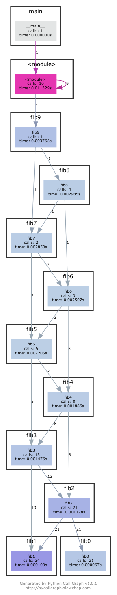

# Exercises 7: Debugging and Profiling

## Debugging

1. Use `journalctl` on Linux or `log show` on macOS to get the super user accesses and commands in the last day.
   If there aren't any you can execute some harmless commands such as `sudo ls` and check again.

   ```
   $ log show --last 1d | grep sudo
   ```

1. Do [this](https://github.com/spiside/pdb-tutorial) hands on `pdb` tutorial to familiarize yourself with the commands. For a more in depth tutorial read [this](https://realpython.com/python-debugging-pdb).

1. Install [`shellcheck`](https://www.shellcheck.net/) and try checking the following script. What is wrong with the code? Fix it. Install a linter plugin in your editor so you can get your warnings automatically.

   ```bash
   #!/bin/sh
   ## Example: a typical script with several problems
   for f in $(ls *.m3u)
   do
     grep -qi hq.*mp3 $f \
       && echo -e 'Playlist $f contains a HQ file in mp3 format'
   done
   ```

   I used [Syntastic](https://vimawesome.com/plugin/syntastic) for my vim linter plugin using [vim-plug](https://github.com/junegunn/vim-plug) plugin manager. It notes there are errors on line 3, line 5 and 6. `shellcheck playlist.sh` to check the error messages or `vim playlist.sh` (assuming Syntastic is installed) Fix the code accordingly:

   ```bash
   #!/bin/sh

   for f in *.m3u
   do
   grep -qi "hq.*mp3" "$f" \
      && echo "Playlist $f contains a HQ file in mp3 format"
   done
   ```

1. (Advanced) Read about [reversible debugging](https://undo.io/resources/reverse-debugging-whitepaper/) and get a simple example working using [`rr`](https://rr-project.org/) or [`RevPDB`](https://morepypy.blogspot.com/2016/07/reverse-debugging-for-python.html).

## Profiling

1. [Here](/static/files/sorts.py) are some sorting algorithm implementations. Use [`cProfile`](https://docs.python.org/3/library/profile.html) and [`line_profiler`](https://github.com/rkern/line_profiler) to compare the runtime of insertion sort and quicksort. What is the bottleneck of each algorithm? Use then `memory_profiler` to check the memory consumption, why is insertion sort better? Check now the inplace version of quicksort. Challenge: Use `perf` to look at the cycle counts and cache hits and misses of each algorithm.

   - Using `cProfile`:

   ```
   $ python -m cProfile -s tottime sorts.py 1000

   Ordered by: internal time

   ncalls  tottime  percall  cumtime  percall filename:lineno(function)
    77977    0.049    0.000    0.110    0.000 random.py:174(randrange)
    77977    0.042    0.000    0.061    0.000 random.py:224(_randbelow)
   34810/1000    0.034    0.000    0.036    0.000 sorts.py:30(quicksort_inplace)
   33336/1000    0.033    0.000    0.050    0.000 sorts.py:21(quicksort)
     1000    0.029    0.000    0.029    0.000 sorts.py:10(insertionsort)
   ```

   To install `line-profiler`, [cython](https://github.com/cython/cython) must be first installed through `pip install cython`. [pip](https://pip.pypa.io/en/stable/installing/) must also be installed. Don't forget to edit `sorts.py` with `@profile` tags before line 10 and line 22 respectively.

   - Line profiling for `insertionsort`:

   ```
   $ kernprof -l -v sorts.py
   Wrote profile results to sorts.py.lprof
   Timer unit: 1e-06 s

   Total time: 0.230475 s
   File: sorts.py
   Function: insertionsort at line 10

   Line #      Hits         Time  Per Hit   % Time  Line Contents
   ==============================================================
      10                                           @profile
      11                                           def insertionsort(array):
      12
      13     24955       7908.0      0.3      3.4      for i in range(len(array)):
      14     23955       7131.0      0.3      3.1          j = i-1
      15     23955       7391.0      0.3      3.2          v = array[i]
      16    212548      77522.0      0.4     33.6          while j >= 0 and v < array[j]:
      17    188593      67494.0      0.4     29.3              array[j+1] = array[j]
      18    188593      54312.0      0.3     23.6              j -= 1
      19     23955       8442.0      0.4      3.7          array[j+1] = v
      20      1000        275.0      0.3      0.1      return array
   ```

   The bottleneck (operation that takes the most time) seems to be the while loop according to the line profiling.

   - Line profiling for `quicksort`:

   ```
   $ kernprof -l -v sorts.py
   Wrote profile results to sorts.py.lprof
   Timer unit: 1e-06 s

   Total time: 0.142668 s
   File: sorts.py
   Function: quicksort at line 22

   Line #      Hits         Time  Per Hit   % Time  Line Contents
   ==============================================================
      22                                           @profile
      23                                           def quicksort(array):
      24     33380      13365.0      0.4      9.4      if len(array) <= 1:
      25     17190       5021.0      0.3      3.5          return array
      26     16190       5506.0      0.3      3.9      pivot = array[0]
      27    123919      51637.0      0.4     36.2      left = [i for i in array[1:] if i < pivot]
      28    123919      49652.0      0.4     34.8      right = [i for i in array[1:] if i >= pivot]
      29     16190      17487.0      1.1     12.3      return quicksort(left) + [pivot] + quicksort(right)
   ```

   The bottleneck (operation that takes the most time) seems to be the `left` and `right` assignments according to the line profiling.

   It can be seen `quicksort` is quicker than `insertionsort`.

   Use then `memory_profiler` to check the memory consumption, why is insertion sort better? Don't forget to edit `sorts.py` with `@profile` tags before line 10 and line 22 respectively.

   - Using `memory_profiler` for `insertionsort`:

   ```
   $ python -m memory_profiler sorts.py
   Filename: sorts.py

   Line #    Mem usage    Increment   Line Contents
   ================================================
    10   24.859 MiB   24.859 MiB   @profile
    11                             def insertionsort(array):
    12
    13   24.859 MiB    0.000 MiB       for i in range(len(array)):
    14   24.859 MiB    0.000 MiB           j = i-1
    15   24.859 MiB    0.000 MiB           v = array[i]
    16   24.859 MiB    0.000 MiB           while j >= 0 and v < array[j]:
    17   24.859 MiB    0.000 MiB               array[j+1] = array[j]
    18   24.859 MiB    0.000 MiB               j -= 1
    19   24.859 MiB    0.000 MiB           array[j+1] = v
    20   24.859 MiB    0.000 MiB       return array
   ```

   - Using `memory_profiler` for `quicksort`:

   ```
   $ python -m memory_profiler sorts.py
   Filename: sorts.py

   Line #    Mem usage    Increment   Line Contents
   ================================================
    20   24.836 MiB   24.801 MiB   @profile
    21                             def quicksort(array):
    22   24.836 MiB    0.000 MiB       if len(array) <= 1:
    23   24.836 MiB    0.000 MiB           return array
    24   24.836 MiB    0.000 MiB       pivot = array[0]
    25   24.836 MiB    0.000 MiB       left = [i for i in array[1:] if i < pivot]
    26   24.836 MiB    0.000 MiB       right = [i for i in array[1:] if i >= pivot]
    27   24.836 MiB    0.004 MiB       return quicksort(left) + [pivot] + quicksort(right)
   ```

   Memory-wise, `insertionsort` should be strictly speaking, better than `quicksort` as it does not allocate extra memory. In the last step of `quicksort`, it concatenates which requires extra memory unlike `insertionsort` which changes its value 'inplace'. (Albeit the difference is ignorable.) `quicksort_inplace` is a function that improves on this redundant memory usage and performs its operations 'inplace', which can be examined using `memory_profiler`.

   - Using `memory_profiler` for `quicksort_inplace`:

   ```
   $ python -m memory_profiler sorts.py
   Filename: sorts.py

   Line #    Mem usage    Increment   Line Contents
   ================================================
    28   24.859 MiB   24.801 MiB   @profile
    29                             def quicksort_inplace(array, low=0, high=None):
    30   24.859 MiB    0.004 MiB       if len(array) <= 1:
    31   24.859 MiB    0.000 MiB           return array
    32   24.859 MiB    0.004 MiB       if high is None:
    33   24.859 MiB    0.000 MiB           high = len(array)-1
    34   24.859 MiB    0.000 MiB       if low >= high:
    35   24.859 MiB    0.000 MiB           return array
    36
    37   24.859 MiB    0.000 MiB       pivot = array[high]
    38   24.859 MiB    0.000 MiB       j = low-1
    39   24.859 MiB    0.004 MiB       for i in range(low, high):
    40   24.859 MiB    0.000 MiB           if array[i] <= pivot:
    41   24.859 MiB    0.000 MiB               j += 1
    42   24.859 MiB    0.000 MiB               array[i], array[j] = array[j], array[i]
    43   24.859 MiB    0.000 MiB       array[high], array[j+1] = array[j+1], array[high]
    44   24.859 MiB    0.000 MiB       quicksort_inplace(array, low, j)
    45   24.859 MiB    0.000 MiB       quicksort_inplace(array, j+2, high)
    46   24.859 MiB    0.000 MiB       return array
   ```

   - Challenge: Use `perf` to look at the cycle counts and cache hits and misses of each algorithm.

     Skipped: `perf` command only exists in Linux and not in macOS.

1. Here's some (arguably convoluted) Python code for computing Fibonacci numbers using a function for each number.

   ```python
   #!/usr/bin/env python
   def fib0(): return 0

   def fib1(): return 1

   s = """def fib{}(): return fib{}() + fib{}()"""

   if __name__ == '__main__':

       for n in range(2, 10):
           exec(s.format(n, n-1, n-2))
       # from functools import lru_cache
       # for n in range(10):
       #     exec("fib{} = lru_cache(1)(fib{})".format(n, n))
       print(eval("fib9()"))
   ```

   Put the code into a file and make it executable. Install [`pycallgraph`](http://pycallgraph.slowchop.com/en/master/). Run the code as is with `pycallgraph graphviz -- ./fib.py` and check the `pycallgraph.png` file. How many times is `fib0` called?. We can do better than that by memoizing the functions. Uncomment the commented lines and regenerate the images. How many times are we calling each `fibN` function now?

   [graphviz](https://pypi.org/project/graphviz/) must be first installed to install `pycallgraph`. After running the code above, `pycallgraph.png` as below would be created in the current folder. According to the image `fib0` is called 21 times.

   

   Uncomment the commented lines. Note that `lru_cache` may not be imported depending on the python version. Mine was python 2.7, so I imported from another module named [`backports.functools_lru_cache`](https://pypi.org/project/backports.functools-lru-cache/). [More](https://stackoverflow.com/questions/45819563/python-importerror-name-lru-cache) on this issue. The revised code is as below.

   ```python
   #!/usr/bin/env python

   def fib0():
    return 0

   def fib1():
      return 1

   s = """def fib{}(): return fib{}() + fib{}()"""

   if __name__ == "__main__":

      for n in range(2, 10):
         exec(s.format(n, n - 1, n - 2))
      from backports.functools_lru_cache import lru_cache
      for n in range(10):
            exec("fib{} = lru_cache(1)(fib{})".format(n, n))
      print(eval("fib9()"))
   ```

   The corresponding new `pycallgraph.png` should show each `fibN` called only one time.

1. A common issue is that a port you want to listen on is already taken by another process. Let's learn how to discover that process pid. First execute `python -m http.server 4444` to start a minimal web server listening on port `4444`. On a separate terminal run `lsof | grep LISTEN` to print all listening processes and ports. Find that process pid and terminate it by running `kill <PID>`.

   When `lsof` is run, there will be a log that starts with Python, and the next column denotes its PID.

   ```
   $ lsof | grep LISTEN
   Python    15190 username    4u  IPv4 0xebd5e4a0507078b7      0t0  TCP *:krb524 (LISTEN)
   $ kill 15190
   ```

   After the `kill` command, it can be seen that the python server running on the other terminal has been successfully terminated.

   ```
   $ python -m http.server 4444
   Serving HTTP on 0.0.0.0 port 4444 (http://0.0.0.0:4444/) ...
   [1]    15190 terminated  /usr/bin/python3 -m http.server 4444
   ```

1. Limiting processes resources can be another handy tool in your toolbox.
   Try running `stress -c 3` and visualize the CPU consumption with `htop`. Now, execute `taskset --cpu-list 0,2 stress -c 3` and visualize it. Is `stress` taking three CPUs? Why not? Read [`man taskset`](http://man7.org/linux/man-pages/man1/taskset.1.html).
   Challenge: achieve the same using [`cgroups`](http://man7.org/linux/man-pages/man7/cgroups.7.html). Try limiting the memory consumption of `stress -m`.

   Skipped. (`stress` and `cgroups` only exists in Linux and not in macOS)

1. (Advanced) The command `curl ipinfo.io` performs a HTTP request an fetches information about your public IP. Open [Wireshark](https://www.wireshark.org/) and try to sniff the request and reply packets that `curl` sent and received. (Hint: Use the `http` filter to just watch HTTP packets).
